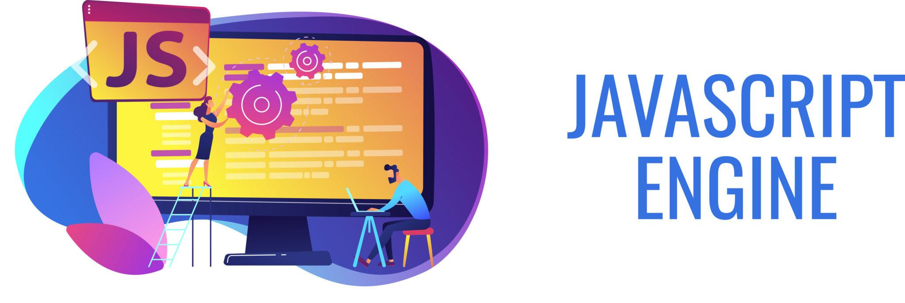

  

# 🚀 Module 01 — JavaScript Foundations

This module marks the beginning of my journey into modern web development.

Here I built the technical foundation that everything else depends on: logic, data handling, execution flow, and asynchronous thinking.

---

## 🧠 What I Learned

### Core JavaScript

- Variables (`let`, `const`) and scope
- Primitive data types
- Type coercion and `typeof`
- Operators (arithmetic, comparison, logical)
- Truthy & falsy behavior
- Control structures (`if`, `else`, `switch`, ternary)

### Working with Data

- Arrays (creation, manipulation, search)
- Objects and nested data structures
- Mutability vs immutability
- Spread operator
- Destructuring
- Object utilities (`Object.keys`, `values`, `entries`)

### Functions

- Function declaration vs arrow functions
- Parameters and return values
- Early return pattern
- Closures
- Functions as values
- Rest parameters
- Default parameters

### Functional Programming

- `map`
- `filter`
- `reduce`
- `find`
- `some`
- `every`

### Asynchronous JavaScript

- `setTimeout`
- Callback pattern
- Promises
- Promise chaining
- `Promise.all`
- `async/await`
- Error handling with `try/catch`

### Additional Topics

- Date manipulation
- Regular Expressions (Regex)
- JSON (`parse`, `stringify`)
- Optional chaining
- ES Modules (`import/export`)

---

## 🛠 What I Practiced

Inside `practica_final/`, I completed:

- Object modeling exercises
- Bug detection and refactoring
- Array transformation challenges
- Async bug fixing using Promises and `async/await`

