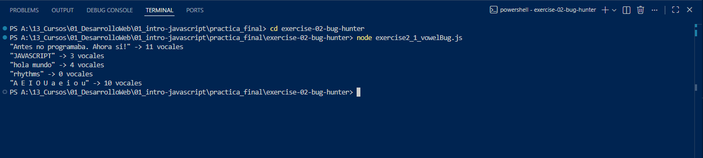
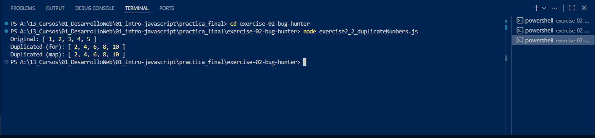

# Exercise 2: Bug Hunter

## 2.1 - Vowel Counter

### 1) Identify the bug  
The function checks each character against the array `["a", "e", "i", "o", "u"]`.  
The issue is that it only matches lowercase vowels. If the text contains uppercase vowels (`A, E, I, O, U`), they are ignored.

### 2) Explain the problem  
Because of that, the function sometimes returns a smaller number than expected.  
Uppercase vowels do not satisfy the condition `vowels.includes(text[i])`, so they are never counted.

### 3) Fix the code  
To solve this, the text is converted to lowercase using `text.toLowerCase()` before iterating through it.  
This way, all vowels are compared in the same format.

### 4) Testing  
In `exercise2_1_vowelBug.js`, I tested the function with different examples:

- `"Antes no programaba. Ahora si!"`
- `"JAVASCRIPT"`
- `"hola mundo"`
- `"rhythms"`
- `"A E I O U a e i o u"`

This confirmed that both uppercase and lowercase vowels are now counted correctly.

### Note about accented vowels

For this implementation, the function only counts basic vowels (`a, e, i, o, u`).  
Accented vowels such as `á, é, í, ó, ú` and characters like `ü` are not included.

Since the original requirement was only to fix the uppercase issue, I kept the solution simple.  

### Vowel counter test output:

---

## 2.2 - Duplicate Numbers (x2)

### 1) Identify the bug  
The original function modifies the array directly (`numbers[i] = numbers[i] * 2`).  
Since arrays are passed by reference in JavaScript, both `numbers` and `original` point to the same array in memory.  
That is why the original array changes as well.

### 2) Explain the concept: pass by reference  
In JavaScript, arrays and objects are not copied automatically.  
Instead, a reference to the same memory location is passed.  
If you modify the array inside a function, you are modifying the original one.

### 3) Fix the code  
To avoid mutating the original array, I created a new array (`duplicatedNumbers`) and stored the multiplied values there.  
This keeps the original array unchanged.

### 4) Bonus using `.map()`  
I also implemented `duplicateNumbersWithMap(numbers)` using the `.map()` method, which returns a new array automatically and makes the solution cleaner.

### Vowel counter test output:

## Verification

To run the exercises:

- `node exercise2_1_vowelBug.js`
- `node exercise2_2_duplicateNumbers.js`

