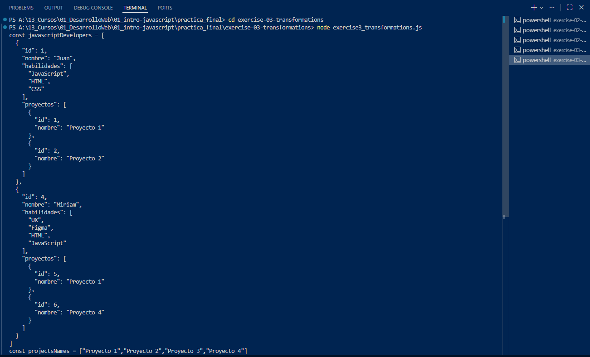

# Exercise 3: Transformations

## 3.1 - Filter JavaScript Developers

### 1) Identify the task  
The client needs a new array with only developers who have `"JavaScript"` in `habilidades`.

### 2) Explain the approach  
I used `.filter()` to keep only matching developers.  
This returns a new array and does not modify the original `data`.

### 3) Implement the fix  
In `exercise3_transformations.js`, the filtering logic is:

```js
const javascriptDevelopers = data.filter((developer) =>
  developer.habilidades.includes("JavaScript")
);
```

## 3.2 - Extract Project Names Without Duplicates

### 1) Identify the task  
The client also needs all project names in one array, without duplicates.

### 2) Explain the approach  
I iterate all developers and their projects.  
Before adding a project name, I check if it already exists using `.includes()`.

### 3) Implement the fix  
In `exercise3_transformations.js`, the project extraction is:

```js
const projectsNames = [];

data.forEach((developer) => {
  developer.proyectos.forEach((project) => {
    if (!projectsNames.includes(project.nombre)) {
      projectsNames.push(project.nombre);
    }
  });
});
```

### Exercise 3: Transformations:



To run the exercise:

- `node exercise3_transformations.js`
