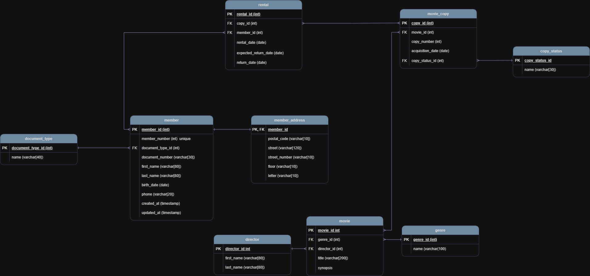

# Final Test - SQL Modeling

  

  
  
  

---

## Context

This practice is based on a video club that needs a database to manage members, movie inventory and rentals.

The solution had to cover the registration of members, optional address information, movies, physical copies of movies, rental records and the identification of currently available movies.

---

## Objective

Design a normalized relational database model and implement it in PostgreSQL.

The final solution must allow:

- registering video club members
- storing an optional correspondence address for members
- registering movies
- storing multiple copies of the same movie
- recording which member rented each copy
- storing rental and return dates
- identifying which movies are currently available and how many copies are available

---

## Data Source

The source data used for the inserts is stored in:

- `03_data/videoclub.xlsx`

The Excel file was reviewed and transformed into a normalized relational structure before generating the final insert script.

---

## Database Configuration

| Item | Value |
|------|-------|
| Database | `keepcoding_web_xx` |
| Schema | `videoclub` |

---

## Main Tables

| Table | Purpose |
|------|---------|
| `document_type` | Stores document types such as DNI or Passport |
| `member` | Stores member information |
| `member_address` | Stores optional member address information |
| `genre` | Stores movie genres |
| `director` | Stores directors |
| `movie` | Stores movie information |
| `movie_copy` | Stores each physical copy of a movie |
| `rental` | Stores rental and return records |

---

## Project Structure

| Folder | Description |
|--------|-------------|
| `00_images/` | Images used in the documentation |
| `01_ERD/` | Entity-relationship diagram files |
| `02_SQL_scripts/` | SQL scripts |
| `03_data/` | Source Excel file used as test data |

---

## SQL Scripts

| Script | Purpose |
|--------|---------|
| `00_create_database.sql` | Creates the database |
| `01_create_tables.sql` | Creates schema and tables |
| `02_insert_data_from_excel.sql` | Loads transformed data from Excel |
| `03_test_queries.sql` | Runs validation queries |
| `00_full_script.sql` | Runs the complete solution in a single execution |

---

## Recommended Execution

If you want to run everything at once, execute:

- `02_SQL_scripts/00_full_script.sql`

This is the main script of the practice.

---

## Execution by Steps

If you prefer to run the project in separate steps:

1. Run `02_SQL_scripts/01_create_tables.sql`
2. Run `02_SQL_scripts/02_insert_data.sql`
3. Run `02_SQL_scripts/03_test_queries.sql`

---

## Validation Queries

The final queries were designed according to the functional requirements and validate:

1. registered members
2. members with optional address information
3. movie catalog with title, genre, director and synopsis
4. rental records by member and movie copy
5. movies currently available and number of available copies

---

## Expected Result

After execution, the database should allow you to:

- inspect member data
- inspect optional address information
- review the movie catalog
- review rental history
- identify the movies that are currently available for rental
- know how many copies of each movie are still available

---

## Deliverables Included

- entity-relationship diagram
- SQL scripts for PostgreSQL
- source Excel file used as input data
- complete execution script
- validation queries based on the practice requirements
