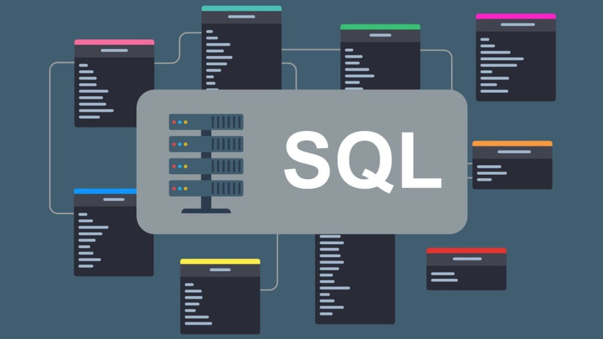

# SQL Modeling

## Module summary

This module covers the foundations of relational database design and SQL.

The main topics studied in this module were:

- entity-relationship modeling
- entities, attributes, relationships and cardinality
- primary keys and foreign keys
- normalization
- first, second and third normal form
- SQL basics in PostgreSQL
- DDL: schemas, table creation, alteration and deletion
- DML: inserts, selects, updates, deletes and joins

## Goal of the module

The objective of this module was to learn how to transform a business problem into a normalized relational model and then implement that model in SQL.

## Contents

- `00_images/`: images used in the documentation
- `01_sql_and_modeling/`: exercises and diagrams from the module
- `02_final_test/`: final practice with ERD, SQL scripts, source data and execution guide
