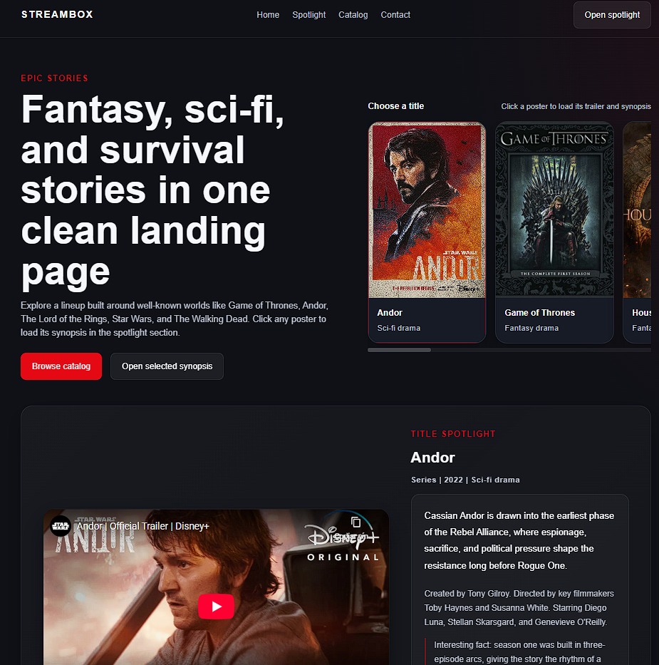
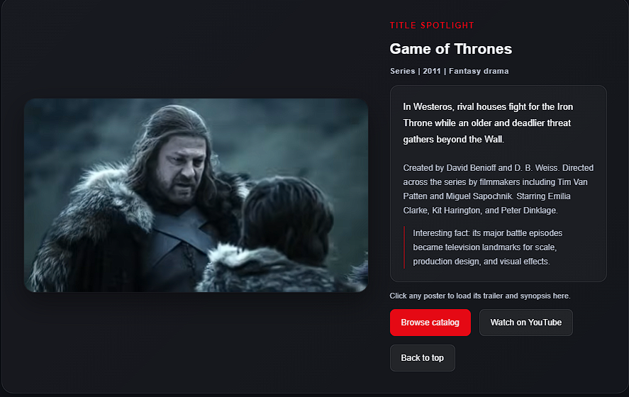

# Final HTML and SCSS Project

  

  
  
  
  
  

---

## Context

This final practice is a streaming-style landing page built for the HTML and SCSS module of the KeepCoding Web Development Bootcamp.

The project was developed as a clean and realistic frontend exercise, using a structure that stays aligned with what was practiced during the module: semantic HTML, modular SCSS, clear folder organization and understandable layouts.

---

## Objective

Build a landing page inspired by a streaming platform interface, including:

- a semantic page structure
- a hero section with calls to action
- horizontal catalog rows
- poster cards
- a featured spotlight area
- a footer with navigation links and copyright

---

## Main Features

- Semantic HTML structure with `header`, `main`, `section` and `footer`
- Hero section with introduction text and poster carousel
- Horizontal content rows inspired by streaming catalog layouts
- Clickable posters that update the spotlight title, synopsis and trailer
- SCSS files organized into base, layout, components and sections
- Local poster assets stored in an ordered image structure
- English UI copy across the full page

---

## Spotlight Preview

  

This screenshot shows the interactive spotlight area where the selected title updates the trailer, synopsis and additional information.

---

## Technologies Used

- HTML5
- CSS3
- SCSS
- Vanilla JavaScript for title selection and spotlight updates

---

## Project Structure

| Path | Description |
|------|-------------|
| `index.html` | Main entry point of the landing page |
| `styles/` | CSS and SCSS files organized by role |
| `styles/base/` | Variables, reset and shared base rules |
| `styles/layout/` | Header, footer and general page layout styles |
| `styles/components/` | Buttons and card styles |
| `styles/sections/` | Hero, rows and featured spotlight styles |
| `scripts/` | Small JavaScript layer for the interactive spotlight |
| `images/` | Posters and visual assets used in the interface |
| `00_images/screenshots/` | Screenshots used in this documentation |
| `WEB_20_practica_final.pdf` | Original final practice brief |

---

## Quick Start

1. Clone or download this repository.
2. Open `03_html-css_fundamentals/00_final-test` in VS Code.
3. Open `index.html`.
4. Click `Go Live` with the Live Server extension.

No installation or build step is required to view the project.

The page already works with `styles/main.css`.

---

## Notes

- The layout uses both Grid and Flexbox depending on the role of each section.
- The content selection behavior is intentionally lightweight and kept in plain JavaScript.
- All screenshots included in this README were taken from the local final result of the project.
