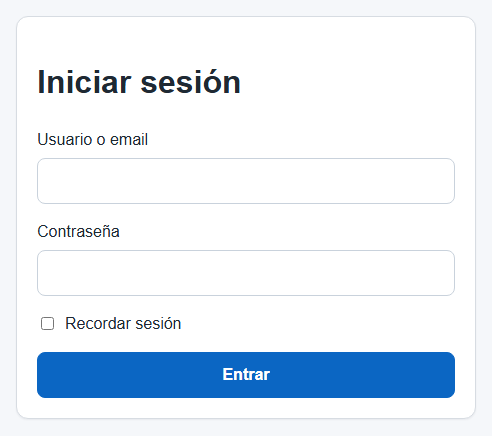
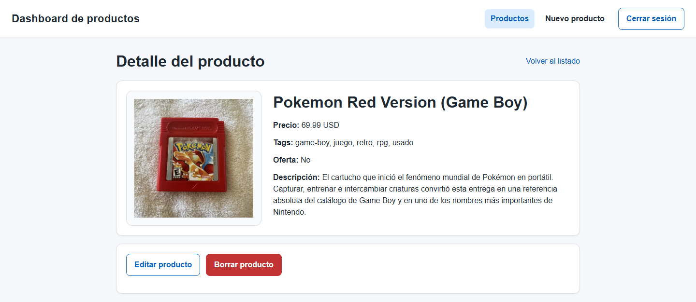
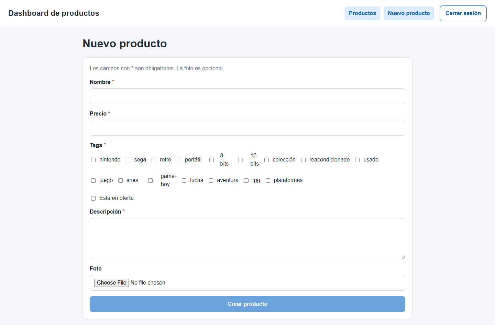

# Final React Fundamentals Project

<p align="center">
  
</p>

<p align="center">
  
  
  
  
  
</p>

---

## Context

This is the final practice project for the React Fundamentals module of the KeepCoding Web Development Bootcamp.

The project was built as a small product dashboard using only the concepts requested in the practice: React, TypeScript, React Router, controlled forms, API consumption, token authentication and a simple visual layer.

---

## Objective

Build a SPA capable of managing a product API with a complete CRUD flow.

The project includes:

- login with token-based access
- protected routes
- product listing
- product detail
- product creation
- product edition
- product deletion
- frontend filtering over the product list

---
### Demo Credentials

- Username: `luke`
- Password: `skywalker`

## What The Project Does

This application manages a catalog of retro consoles and classic video games.

The main behavior is:

- authenticate the user before entering the dashboard
- request data from the backend after login
- show a product list with price, tags and sale status
- filter the list by product name and sale status
- navigate to a product detail page
- create new products with controlled React forms
- edit existing products while keeping the current image if needed
- delete products with a React-based confirmation step
- upload optional product images to the backend

---

## Screenshots

### Login

<p align="center">
  
</p>

### Product Detail

<p align="center">
  
</p>

### New Product Form

<p align="center">
  
</p>

---

## Technologies Used

- React
- TypeScript
- React Router
- Vite
- Native `fetch`
- Simple CSS for layout and visual organization

---

## Project Structure

| Path | Description |
|------|-------------|
| `src/` | Application source code |
| `src/components/` | Reusable UI and route protection components |
| `src/pages/` | Main application pages |
| `src/services/` | API and authentication helpers |
| `public/products/` | Local images used by the project |
| `00_images/screenshots/` | Screenshots used in this documentation |
| `practica.md` | Original practice brief for this delivery |

---

## How To Run

1. Open a terminal in `07_react-fundamentos/01_react-fundamentos-course/server`
2. Install dependencies if needed:

```bash
npm install
```

3. Start the backend:

```bash
npm start
```

4. Open another terminal in `07_react-fundamentos/02_final_test`
5. Install dependencies if needed:

```bash
npm install
```

6. Start the frontend:

```bash
npm run dev
```

7. Open `http://localhost:5173`

### Demo Credentials

- Username: `luke`
- Password: `skywalker`

---
