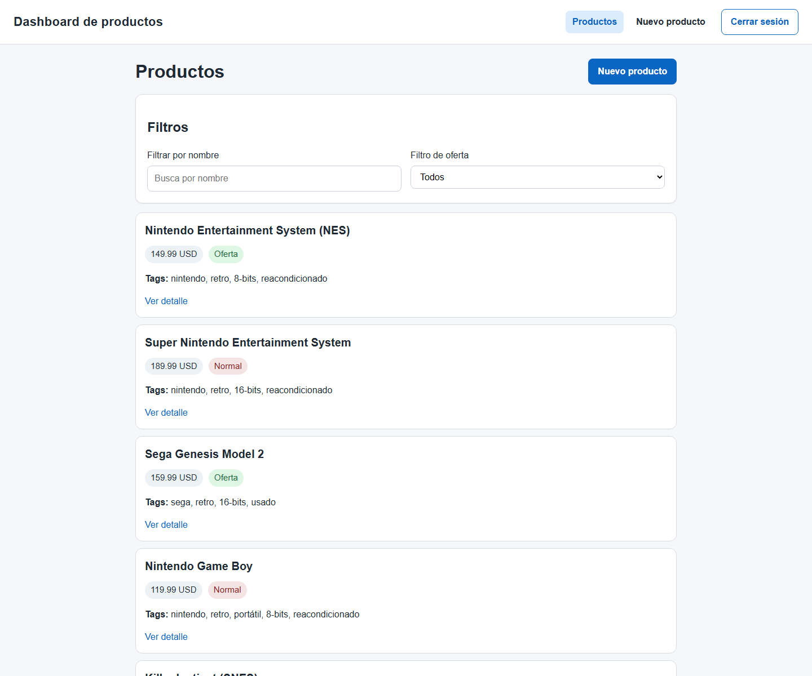

# React Fundamentals

  

  
  
  
  
  

---

## Module Overview

This module focused on the foundations of building a Single Page Application with React and TypeScript.

The work covered the React mental model from the basics up to a small real CRUD app with routing, protected pages, API consumption, controlled forms and authentication with token-based access.

---

## Main Topics Covered

- React fundamentals and JSX
- Functional components and props
- Event handling and conditional rendering
- Rendering lists with dynamic data
- State management with `useState`
- Side effects with `useEffect`
- Controlled forms and validation
- Basic React Router usage
- Protected routes
- CRUD flows connected to an API
- Token handling and authenticated requests

---

## What Was Practiced

Throughout the module, the work moved from small classroom demos to a more complete product dashboard.

This included:

- understanding component composition
- lifting state and reusing logic
- working with controlled forms without form libraries
- validating user input with React state
- consuming external data with `fetch`
- handling loading, error and empty states
- protecting routes behind login
- organizing a small React + TypeScript project in a clean way

---

## Module Goal

The goal of this module was to understand how React works in practice and use that knowledge to build a small but complete SPA with TypeScript, routing, forms and API integration.

---

## Repository Structure

| Folder | Description |
|--------|-------------|
| `00_images/` | Images used in this module documentation |
| `01_react-fundamentos-course/` | Official module material, demos, notes and backend used during the course |
| `02_final_test/` | Final React practice project with documentation, screenshots and runnable source code |

---

## Final Practice

The final practice is documented in:

- [`02_final_test/README.md`](02_final_test/README.md)

That folder contains the complete React + TypeScript project, the original practice brief, screenshots of the final result and instructions to run both frontend and backend.
