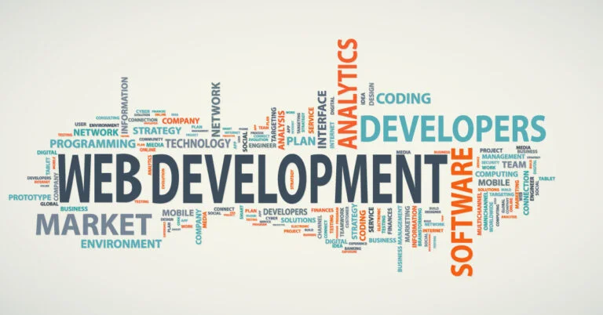

# KeepCoding – Web Development Bootcamp

  

This repository documents my progress throughout the KeepCoding Web Development Bootcamp and serves as a structured record of the modules, exercises and deliverables completed during the program.

This is my second bootcamp. Previously, I completed specialized training in:

- Big Data
- Artificial Intelligence
- Machine Learning

This stage represents the expansion of that background into full-stack software development and modern engineering practices.

---

## About Me

I come from an economics background and transitioned into technology with a strong focus on systems, data and software development.

**Industrial Data Engineer | MES & OEE Systems | SQL • Node • React • Python • EUROMAP/Modbus/OPC-UA**

Over the last year and a half, I have been working on the design and implementation of MES and OEE systems focused on:

- real-time acquisition of critical production data
- industrial process monitoring
- KPI calculation and control
- backend logic and database design
- operational dashboards and system integration

My work has been closely related to manufacturing environments, where software, industrial connectivity and data engineering must come together to support real operational decisions.

This bootcamp strengthens that profile by adding a stronger foundation in web development, frontend architecture, backend systems and full-stack application design.

---

## About the Bootcamp

The KeepCoding Web Development Bootcamp is an intensive program designed to build complete web development skills from fundamentals to production-ready applications.

The training combines theory and practice across areas such as:

- programming fundamentals
- frontend development
- backend development
- relational databases and data modeling
- DevOps and deployment
- testing and software quality
- real-world project implementation

The goal is to develop the ability to design, build and deploy complete applications using solid engineering practices.

---

## Repository Purpose

This repository is organized as a workspace for the bootcamp modules and deliveries.

Each folder represents a module, practice or project developed during the program. The purpose is to keep a clear record of:

- topics studied
- practical exercises
- module deliveries
- technical documentation
- final projects

---

## Program Roadmap

### Phase 1 – Foundations
01. Onboarding  
02. Advanced UX Research  
03. Online Kickoff  
04. GitHub Foundations  
05. Introduction to JavaScript  
06. GitHub Delivery  
07. JavaScript Delivery  

### Phase 2 – Frontend Fundamentals
08. HTML & CSS Foundations  
09. HTML & CSS Delivery  
10. Data Modeling & Introduction to SQL  
11. SQL Delivery  

### Phase 3 – Backend Development
12. Backend Development with Node.js  
13. Backend Delivery  
20. Advanced Backend with Node.js  
21. Advanced Backend Delivery  

### Phase 4 – Frontend Advanced and React
14. Frontend Development with JavaScript  
15. Frontend Delivery  
16. Frontend PRO  
17. React Fundamentals  
18. React Delivery  
23. Advanced React  
24. Advanced React Delivery  

### Phase 5 – Engineering and Production
19. TDD with JavaScript  
22. Technical Interview Masterclass  
25. Server Configuration & Application Deployment  
26. Deployment Delivery  

### Phase 6 – Final Projects
27. Final Full-Stack Projects  

---

## Current Focus

This repository will continue growing as new modules and deliverables are completed.

The intention is not only to store final results, but to reflect the progression from technical foundations to full-stack development, supported by prior experience in industrial systems, real-time data acquisition and production KPI platforms.
